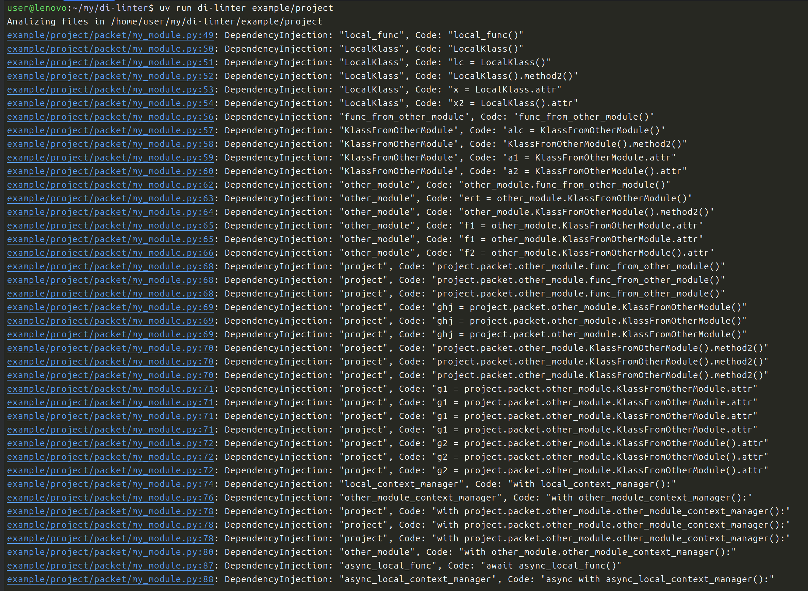

# Dependency Injection Linter
Static code analysis for search of dependencies injection

## Installation
```bash
pip install di-linter
```
Or
```bash
uv add --dev di-linter
```

## Usage

### As a standalone tool
1. Run the script in the project's root directory and specify the project directory name
```bash
  di-linter project
```
Or
```bash
  uv run di-linter project
```

2. Run the script in the project's root directory without arguments. 
It contains a toml config file where the project directory name is specified.
```bash
  di-linter
```
Or
```bash
  uv run di-linter
```

### As a flake8 plugin
The linter can also be used as a flake8 plugin:

```bash
flake8 --select=DI path/to/your/project
```

## Configuration

### Standalone tool configuration
Create a file `di.toml` in project root directory:
```toml
project-root = "project"
exclude-objects = ["Settings", "DIContainer"]
exclude-modules = ["endpoints.py"]
```

### flake8 plugin configuration
Add the following to your flake8 configuration file (e.g., `.flake8`, `setup.cfg`, or `tox.ini`):

```ini
[flake8]
select = DI
di-exclude-objects = Settings,DIContainer
di-exclude-modules = endpoints.py
```

## Output message

